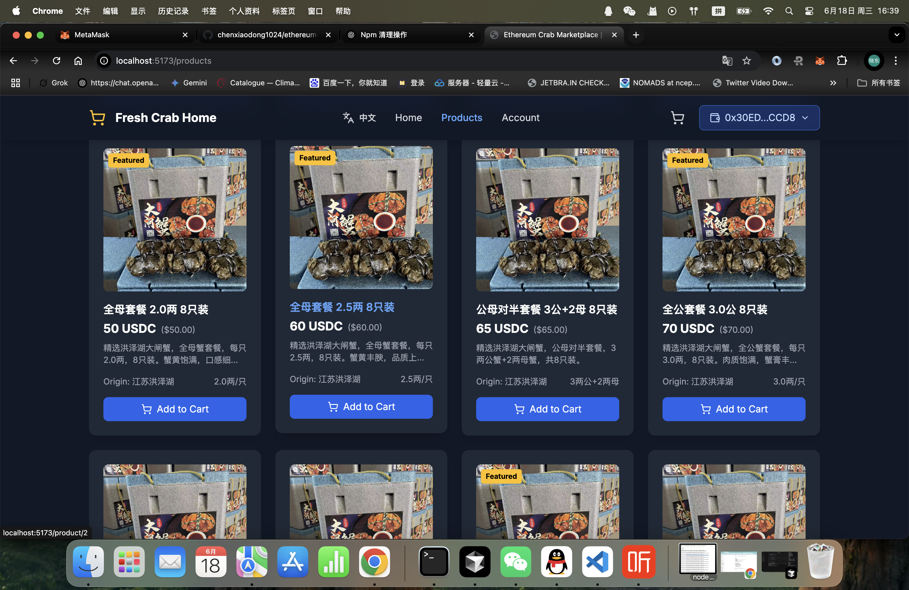
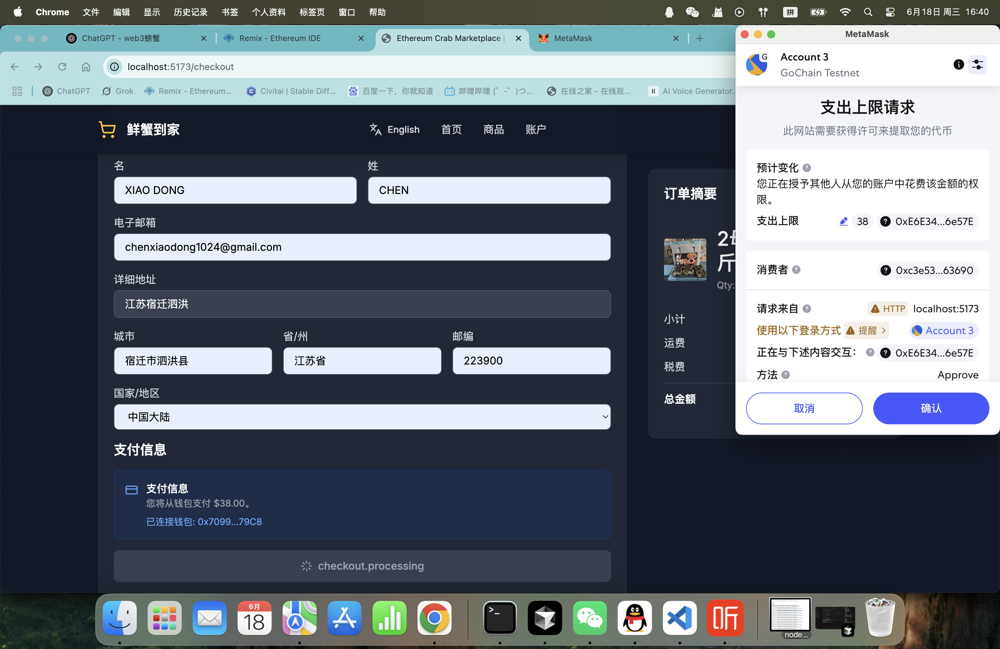
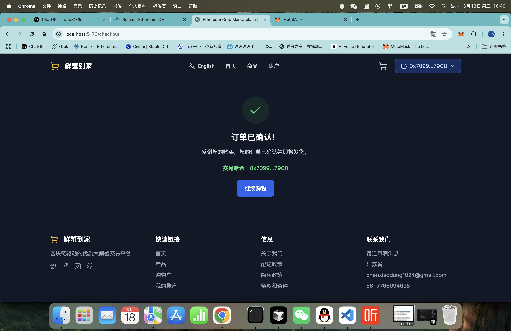
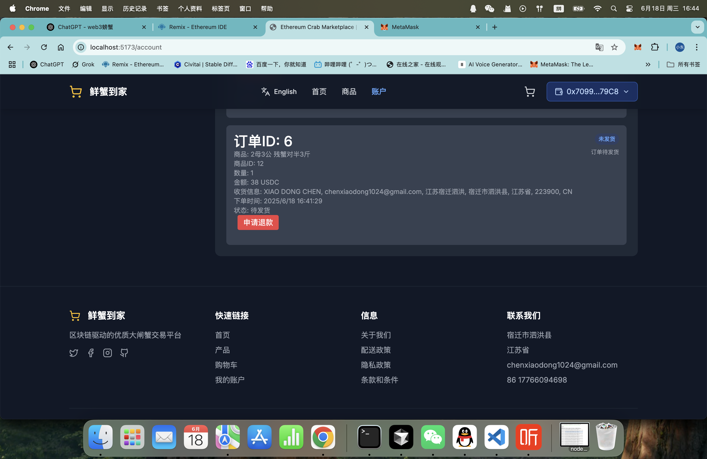
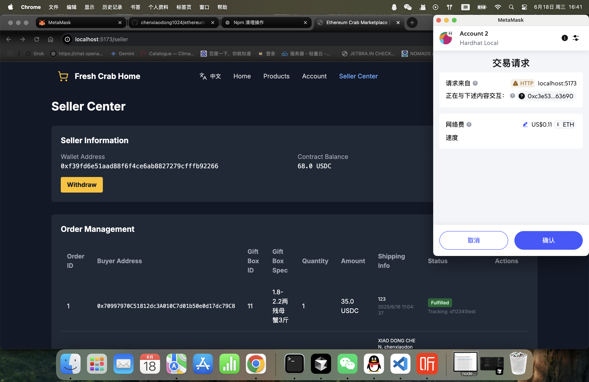

# 🦀 Ethereum Crab Marketplace

> **Hongze Lake Crabs on the Ethereum Blockchain**

A decentralized marketplace for authentic Hongze Lake crabs, powered by Ethereum smart contracts and USDC payments.

**[English Version](README.md) | [中文版本](README_CN.md)**

---

## ✨ Features

- 🦀 **Authentic Hongze Lake Crabs** - Direct from source, blockchain-verified
- 💰 **USDC Payments** - Secure, transparent transactions on Ethereum
- 🔗 **Smart Contract Integration** - Automated order processing and inventory management
- 🌐 **Multi-language Support** - Chinese and English interfaces
- 📱 **Responsive Design** - Works on desktop and mobile devices
- 🔒 **Wallet Integration** - MetaMask and other Web3 wallet support

## 🛠️ Tech Stack

- **Frontend**: React 18 + TypeScript + Vite
- **Styling**: Tailwind CSS
- **Blockchain**: Ethereum + Ethers.js
- **Payments**: USDC (ERC-20)
- **Smart Contracts**: Solidity
- **Internationalization**: i18next

## 🚀 Quick Start

### Prerequisites

- Node.js 16+ 
- MetaMask or other Web3 wallet
- USDC tokens on Ethereum network

### Installation

```bash
# Clone the repository
git clone https://github.com/chenxiaodong1024/ethereum-crab-marketplace.git

# Navigate to project directory
cd ethereum-crab-marketplace

# Install dependencies
npm install

# Start development server
npm run dev
```

### Smart Contract Deployment

1. Deploy the `CrabUSDC.sol` contract to Ethereum network
2. Update the contract address in `src/utils/contract.ts`
3. Configure USDC token address

## 📋 Project Structure

```
src/
├── components/          # React components
├── contexts/           # React contexts (Web3)
├── contracts/          # Smart contract ABIs
├── data/              # Product data and API functions
├── i18n/              # Internationalization
├── pages/             # Page components
├── types/             # TypeScript type definitions
└── utils/             # Utility functions
```

## 🔗 Smart Contract

The marketplace uses a custom smart contract (`CrabUSDC.sol`) that handles:

- Product inventory management
- Order processing
- USDC payment processing
- Refund management
- Order fulfillment tracking

## 🌍 Supported Networks

- **Ethereum Mainnet** (Production)
- **Sepolia Testnet** (Testing)
- **Local Development** (Hardhat/Ganache)

## 📱 Screenshots

### 🏠 Homepage


### 🦀 Products Page


### 🛒 Checkout Process



### 👤 User Account


### 🏪 Seller Center


## 📄 License

This project is licensed under the MIT License - see the [LICENSE](LICENSE) file for details.

## 🦀 About Hongze Lake Crabs

Hongze Lake crabs are renowned for their superior quality and taste. Our marketplace ensures:

- **Direct from Source**: No middlemen, fresh from Hongze Lake
- **Quality Guarantee**: Blockchain-verified authenticity
- **Transparent Supply Chain**: Every crab is traceable
- **Fair Pricing**: Competitive prices with transparent costs

## 📞 Contact

- **Website**: [www.sihongpangxie.site](https://www.sihongpangxie.site)
- **Email**: chenxiaodong1024@gmail.com
- **Phone**: +86 17766094698
- **Address**: Hongze Lake Crab Base, Sihong County, Suqian City, Jiangsu Province

---

**Built with ❤️ for the Ethereum ecosystem and crab lovers worldwide!**

---

**[English Version](README.md) | [中文版本](README_CN.md)** 
