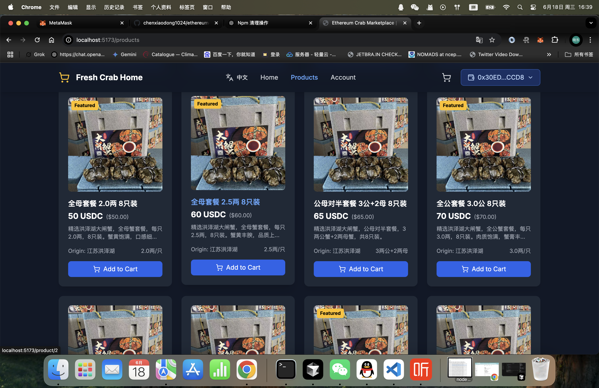
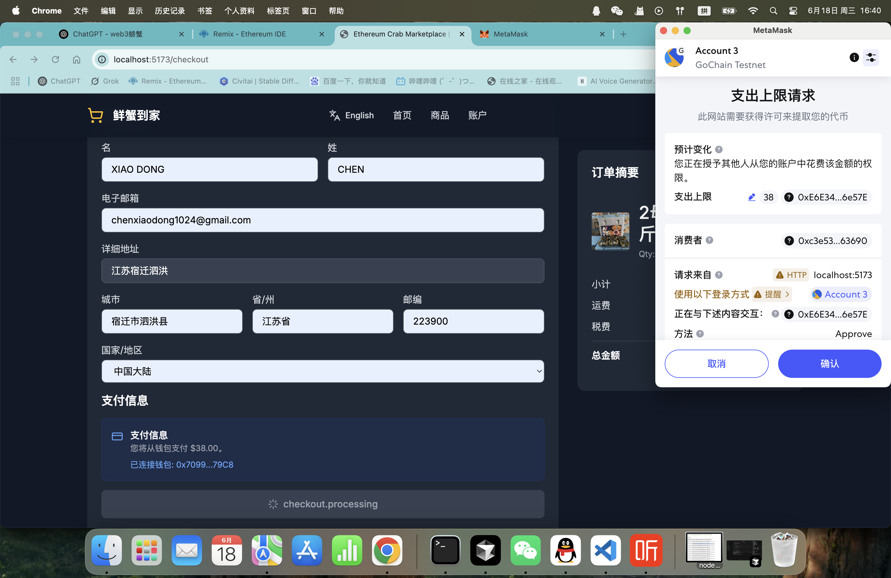
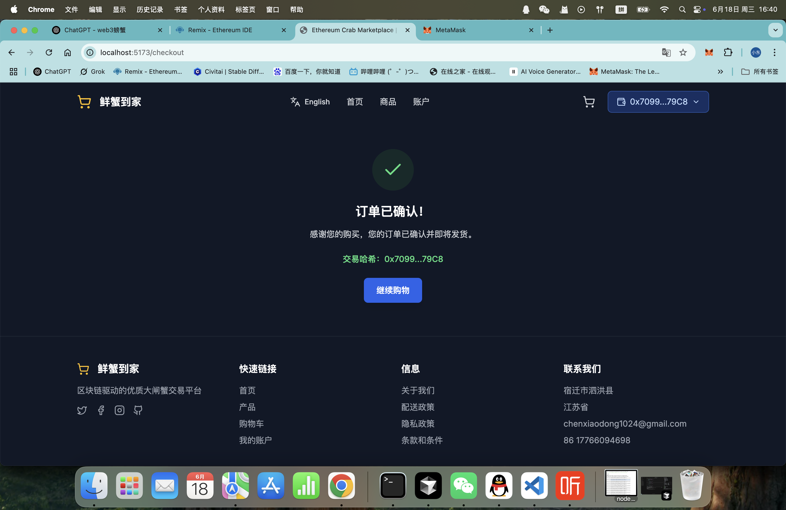
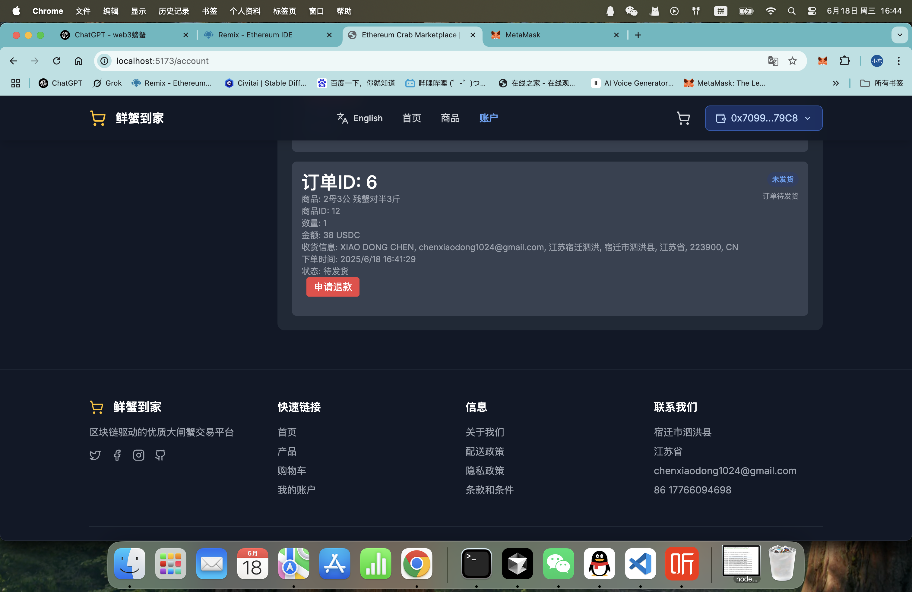
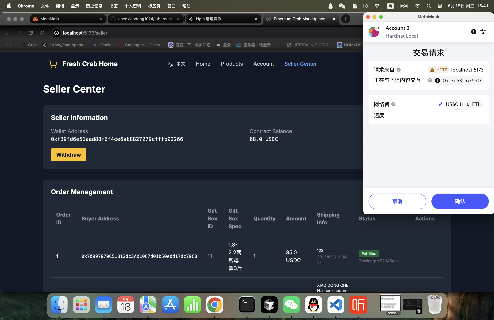

# 🦀 以太坊螃蟹市场

> **区块链上的洪泽湖大闸蟹**

基于以太坊智能合约和 USDC 支付的洪泽湖大闸蟹去中心化交易平台。

## ✨ 功能特色

- 🦀 **正宗洪泽湖大闸蟹** - 源头直供，区块链验证
- 💰 **USDC 支付** - 以太坊上安全透明的交易
- 🔗 **智能合约集成** - 自动化订单处理和库存管理
- 🌐 **多语言支持** - 中英文界面
- 📱 **响应式设计** - 支持桌面和移动设备
- 🔒 **钱包集成** - 支持 MetaMask 等 Web3 钱包

## 🛠️ 技术栈

- **前端**: React 18 + TypeScript + Vite
- **样式**: Tailwind CSS
- **区块链**: 以太坊 + Ethers.js
- **支付**: USDC (ERC-20)
- **智能合约**: Solidity
- **国际化**: i18next

## 🚀 快速开始

### 前置要求

- Node.js 16+
- MetaMask 或其他 Web3 钱包
- 以太坊网络上的 USDC 代币

### 安装

```bash
# 克隆仓库
git clone https://github.com/chenxiaodong1024/ethereum-crab-marketplace.git

# 进入项目目录
cd ethereum-crab-marketplace

# 安装依赖
npm install

# 启动开发服务器
npm run dev
```

### 智能合约部署

1. 将 `CrabUSDC.sol` 合约部署到以太坊网络
2. 在 `src/utils/contract.ts` 中更新合约地址
3. 配置 USDC 代币地址

#### 当前部署 (Sepolia 测试网)

- **CrabUSDC 合约**: `0x6A98050e97CE3224a8E8df91973f6Abf3C977FAb`
- **USDC 代币**: `0xA044057E59035d455B2C23B41C6B29BdadEcd967`
- **网络**: Sepolia 测试网 (链 ID: 11155111)

连接到测试网：
1. 在 MetaMask 中添加 Sepolia 网络
2. 从 [Sepolia 水龙头](https://sepoliafaucet.com/) 获取测试 ETH
3. 连接钱包到应用程序

## 📋 项目结构

```
src/
├── components/          # React 组件
├── contexts/           # React 上下文 (Web3)
├── contracts/          # 智能合约 ABI
├── data/              # 产品数据和 API 函数
├── i18n/              # 国际化
├── pages/             # 页面组件
├── types/             # TypeScript 类型定义
└── utils/             # 工具函数
```

## 🔗 智能合约

该市场使用自定义智能合约 (`CrabUSDC.sol`)，处理以下功能：

- 产品库存管理
- 订单处理
- USDC 支付处理
- 退款管理
- 订单履行跟踪

## 🌍 支持的网络

- **以太坊主网** (生产环境)
- **Sepolia 测试网** (测试环境)
- **本地开发** (Hardhat/Ganache)

## 📱 截图

### 🏠 首页


### 🦀 商品列表


### 🛒 下单流程



### 👤 用户中心


### 🏪 卖家中心


## 📄 许可证

本项目采用 MIT 许可证 - 详情请参阅 [LICENSE](LICENSE) 文件。

## 🦀 关于洪泽湖大闸蟹

洪泽湖大闸蟹以其卓越的品质和口感而闻名。我们的市场确保：

- **源头直供**: 无中间商，直接从洪泽湖新鲜供应
- **品质保证**: 区块链验证的真实性
- **透明供应链**: 每只螃蟹都可追溯
- **公平定价**: 具有透明成本的竞争性价格

## 📞 联系方式

- **网站**: [www.sihongpangxie.site](https://www.sihongpangxie.site)
- **邮箱**: chenxiaodong1024@gmail.com
- **电话**: +86 17766094698
- **地址**: 江苏省宿迁市泗洪县洪泽湖大闸蟹基地

---

**为以太坊生态系统和全球螃蟹爱好者而建！❤️**

---

**[English Version](README.md) | [中文版本](README_CN.md)** 